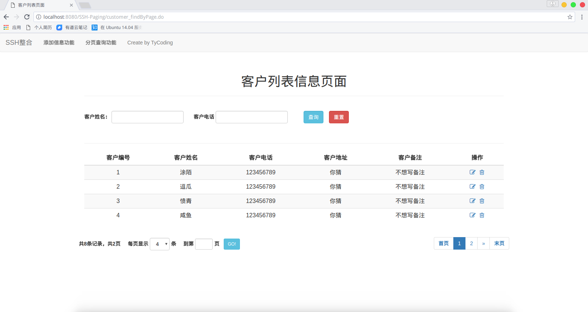

**SSH框架整合、分页查询案例**

Spring、Hibernate、Struts2框架虽然现在已经不是很流行，但是在一写公司的老项目中仍然在使用，多学一种技术总没有坏处，所以如果大家刚学完了Spring、Struts、Hibernate框架，那么这个项目将教会你如何对这三大框架进行整合。


# 关于项目

## 项目环境

```
框架：
	后端：spring + struts2 + hibernate5.x
	前端：bootstrap + Fontawesome图标集
环境：IDEA + maven + mysql5.7 + Tomcat8
```

## 项目功能

```
1. 用户登录
2. 客户信息的增、删、改、查
3. 客户信息的列表展示和分页查询功能
```

项目源码请点击[SSH框架整合](https://github.com/TyCoding/ssh) 进入我的GitHub。

## 项目结构


# jar依赖

因为本项目使用了maven，如果你对maven项目不了解，可以查看我这篇博文：[maven起步](http://tycoding.cn/2018/06/01/maven/)

```xml
<project xmlns="http://maven.apache.org/POM/4.0.0" xmlns:xsi="http://www.w3.org/2001/XMLSchema-instance"
         xsi:schemaLocation="http://maven.apache.org/POM/4.0.0 http://maven.apache.org/maven-v4_0_0.xsd">
  <modelVersion>4.0.0</modelVersion>
  <groupId>cn</groupId>
  <artifactId>ssh</artifactId>
  <packaging>war</packaging>
  <version>1.0-SNAPSHOT</version>
  <name>customer Maven Webapp</name>
  <url>http://maven.apache.org</url>
  <build>
    <finalName>customer</finalName>
    <resources>
      <resource>
        <directory>${basedir}/src/main/java</directory>
        <includes>
          <include>**/*.properties</include>
          <include>**/*.xml</include>
        </includes>
      </resource>
      <resource>
        <directory>${basedir}/src/main/resources</directory>
      </resource>
    </resources>
  </build>

  <properties>
    <maven.compiler.source>1.8</maven.compiler.source>
    <maven.compiler.target>1.8</maven.compiler.target>
  </properties>

  <dependencies>
    <!-- 单元测试 -->
    <dependency>
      <groupId>junit</groupId>
      <artifactId>junit</artifactId>
      <version>4.11</version>
    </dependency>

    <!-- 1.日志 -->
    <!-- 实现slf4j接口并整合 -->
    <dependency>
      <groupId>ch.qos.logback</groupId>
      <artifactId>logback-classic</artifactId>
      <version>1.1.1</version>
    </dependency>

    <!-- 2.数据库 -->
    <dependency>
      <groupId>mysql</groupId>
      <artifactId>mysql-connector-java</artifactId>
      <version>5.1.37</version>
      <scope>runtime</scope>
    </dependency>
    <dependency>
      <groupId>c3p0</groupId>
      <artifactId>c3p0</artifactId>
      <version>0.9.1.2</version>
    </dependency>

    <dependency>
      <groupId>org.springframework</groupId>
      <artifactId>spring-context</artifactId>
      <version>4.3.10.RELEASE</version>
    </dependency>
    <dependency>
      <groupId>org.apache.struts</groupId>
      <artifactId>struts2-spring-plugin</artifactId>
      <version>2.5.12</version>
    </dependency>
    <dependency>
      <groupId>aspectj</groupId>
      <artifactId>aspectjweaver</artifactId>
      <version>1.5.4</version>
    </dependency>
    <dependency>
      <groupId>org.springframework</groupId>
      <artifactId>spring-orm</artifactId>
      <version>4.3.10.RELEASE</version>
    </dependency>
    <dependency>
      <groupId>org.hibernate</groupId>
      <artifactId>hibernate-core</artifactId>
      <version>5.2.10.Final</version>
    </dependency>
    <dependency>
      <groupId>org.hibernate</groupId>
      <artifactId>hibernate-c3p0</artifactId>
      <version>5.2.10.Final</version>
    </dependency>
    <!-- 3.Servlet web -->
    <dependency>
      <groupId>jstl</groupId>
      <artifactId>jstl</artifactId>
      <version>1.2</version>
    </dependency>
    <dependency>
      <groupId>com.fasterxml.jackson.core</groupId>
      <artifactId>jackson-databind</artifactId>
      <version>2.5.4</version>
    </dependency>
    <dependency>
      <groupId>javax.servlet</groupId>
      <artifactId>javax.servlet-api</artifactId>
      <version>3.1.0</version>
    </dependency>

    <dependency>
      <groupId>net.sf.json-lib</groupId>
      <artifactId>json-lib</artifactId>
      <version>2.4</version>
      <classifier>jdk15</classifier>
    </dependency>
    <dependency>
      <groupId>org.apache.struts</groupId>
      <artifactId>struts2-json-plugin</artifactId>
      <version>2.5.12</version>
    </dependency>
    <dependency>
      <groupId>com.alibaba</groupId>
      <artifactId>fastjson</artifactId>
      <version>1.2.46</version>
    </dependency>
  </dependencies>
</project>
```

# 创建数据库

注：由于使用hibernate，我们已配置表结构由hibernate自动生成，这里就不需要我们创建了

```
create database ssh_paging character set utf8;

# 插入数据
# 以下代码需要在启动Tomcat运行项目后才能执行，不然还没有创建表结构，我们怎么插入数据呢。
insert into Admin values(a,'admin','admin');

insert into Customer values(1,'涂陌','123456789','你猜','不想写备注');
insert into Customer values(2,'逗瓜','123456789','你猜','不想写备注');
insert into Customer values(3,'愤青','123456789','你猜','不想写备注');
insert into Customer values(4,'咸鱼','123456789','你猜','不想写备注');
insert into Customer values(5,'小白','123456789','你猜','不想写备注');
insert into Customer values(6,'菜鸡','123456789','你猜','不想写备注');
```

# PageBean的封装

```java
package com.cutton.pojo;

import java.io.Serializable;
import java.util.List;

/**
 * @author huys
 * @date 18-3-10下午12:47
 */
public class PageBean<T> implements Serializable {

    //当前页
    private int pageCode;

    //总页数=总条数/每页显示的条数
    //private int totalPage;

    //总记录数
    private int totalCount;

    //每页显示的记录条数
    private int pageSize;

    //每页显示的数据
    private List<T> beanList;

    public int getPageCode() {
        return pageCode;
    }

    public void setPageCode(int pageCode) {
        this.pageCode = pageCode;
    }

    /**
     * 调用getTotalPage() 获取到总页数
     * JavaBean属性规定：totalPage是javaBean属性 ${pageBean.totalPage}
     */
    public int getTotalPage() {
        //计算
        int totalPage = totalCount / pageSize;
        //说明整除
        if(totalCount % pageSize == 0){
            return totalPage;
        }else{
            return totalPage + 1;
        }
    }

   /* public void setTotalPage(int totalPage) {
        this.totalPage = totalPage;
    }*/

    public int getTotalCount() {
        return totalCount;
    }

    public void setTotalCount(int totalCount) {
        this.totalCount = totalCount;
    }

    public int getPageSize() {
        return pageSize;
    }

    public void setPageSize(int pageSize) {
        this.pageSize = pageSize;
    }

    public List<T> getBeanList() {
        return beanList;
    }

    public void setBeanList(List<T> beanList) {
        this.beanList = beanList;
    }

}
```

# 后端代码编写

## 编辑功能

处理前台模态框的编辑功能部分

```java
/**
     * 为模态框提供的查询功能
     * 处理ajax的请求
     */
    public String search() {
        try {
            HttpServletRequest request = ServletActionContext.getRequest();
            HttpServletResponse response = ServletActionContext.getResponse();
            request.setCharacterEncoding("UTF-8");
            response.setContentType("text/html;charset=UTF-8");
            customer = customerService.findById(customer.getC_id());

            //将数据放到Map集合中，再转换成json格式的数据
            Map<String, Object> map = new HashMap<String, Object>();
            map.put("c_id", customer.getC_id());
            map.put("c_name", customer.getC_name());
            map.put("c_telephone", customer.getC_telephone());
            map.put("c_address", customer.getC_address());
            map.put("c_remark", customer.getC_remark());

            //将Map集合数据转换成json格式的数据
            JSONObject json = JSONObject.fromObject(map);
            result = json.toString();
            System.out.println("这里我要传给前台页面的JSON数据是："+result);
        } catch (Exception e) {
            e.printStackTrace();
        }
        return SUCCESS;
    }
```

​	**说明：**

这里我们就要说一下了，首先我们要明白这个功能：其实就是普通的更新数据的功能，即当我们点击编辑按钮的时候需要先ajax异步请求去后台根据点击的字段id去查询对应的数据库信息，然后将数据以JSON的格式返回给页面，最后页面解析JSON格式数据，回显在编辑框中，实现编辑。

那么，在这里是怎样进行将这个JSON格式数据返回给页面呢？我们需要看一下struts2.xml中配置：

```xml
<package name="struts2" namespace="/" extends="struts-default,json-default">
<action name="customer_*" class="customerAction" method="{1}">
	<result type="json">
          <param name="root">result</param>
     </result>
     <allowed-methods>search</allowed-methods>
</action>
</package>

```

1. 注意一下这个`<allowed-methods>`是为我们的通配符服务的，在struts2.3版本以后，如果我们没有写这个而直接使用通配符就会报错找不到映射，所以需要配置这个标签，格式：`<allowed-methods>方法名1，方法名2…</allowed-methods>`。详情请参考这篇 [博文](https://blog.csdn.net/qq_29663071/article/details/53009287)

2. 注意`<result type="json">`在struts2中是用来做Ajax请求的，所以根本没有跳转页面，写这个标签，会将你Action中的变量转换成JSON格式数据返回到页面，
  那么`<param name="root">result</param>`就会将你要返回的数据result（JSON字符串）返回给页面，在页面使用`var d = eval("("+data+")");` 的方式将JSON字符串解析成JSON格式数据，然后我们就能通过ognl表达式解析获取数据，然后给指定的编辑框中赋值数据了。Ajax部分:

  ```js
  // 先去查询数据
  $.ajax({
       url: '<%=basePath%>/customer_search.do?c_id='+c_id,
       type: 'POST',
       dataType: 'json',
       contentType: 'application/json;charset=UTF-8',
       data: {},
       success: function(data){
       var d = eval("("+data+")");
       $("#c_id").val(d.c_id);
       $("#c_name").val(d.c_name);
       $("#c_telephone").val(d.c_telephone);
       $("#c_address").val(d.c_address);
       $("#c_remark").val(d.c_remark);
       $("#editModal").modal('show');
       },
       error: function(){
            alert("错误");
       }
  });
  ```

  详情参考这篇 [博文](http://www.cnblogs.com/myjavawork/archive/2011/03/10/1979279.html)

## 分页功能

处理分页逻辑功能部分

```java
  /**
    * 分页查询相关
    */
    //属性驱动方式，当前页，默认页1
    private Integer pageCode = 1;
    public void setPageCode(Integer pageCode) {
        if(pageCode == null){
            pageCode = 1;
        }
        this.pageCode = pageCode;
    }

    //默认每页显示的数据条数
    private Integer pageSize = 4;
    public void setPageSize(Integer pageSize) {
        this.pageSize = pageSize;
    }

    //分页查询的方法
    public String findByPage(){
        //调用service层
        DetachedCriteria criteria = DetachedCriteria.forClass(Cutton.class);
        //查询
        PageBean<Cutton> page = cuttonService.findByPage(pageCode,pageSize,criteria);
        //压栈
        ValueStack vs = ActionContext.getContext().getValueStack();
        //顶栈是map<"page",page对象>
        vs.set("page",page);
        return "page";
    }
```

## dao

处理分页逻辑

```java
    /**
     * 分页查询的方法
     * @param pageCode
     * @param pageSize
     * @param criteria
     * @return
       */
    @Override
    public PageBean<Cutton> findByPage(Integer pageCode, Integer pageSize, DetachedCriteria 	criteria) {
        PageBean<Cutton> page = new PageBean<Cutton>();
        page.setPageCode(pageCode);
        page.setPageSize(pageSize);

        //先查询总记录数 select count(*)
        criteria.setProjection(Projections.rowCount());
        List<Number> list = (List<Number>) this.getHibernateTemplate().findByCriteria(criteria);
        if(list != null && list.size() > 0){
            int totalCount = list.get(0).intValue();
            //总记录数
            page.setTotalCount(totalCount);
        }

        //要吧select count(*) 先清空 变成select *...
        criteria.setProjection(null);

        //提供分页查询
        List<Cutton> beanList = (List<Cutton>) this.getHibernateTemplate().findByCriteria(criteria,(pageCode - 1)*pageSize, pageSize);

        //分页查询的数据，每页显示的数据，使用limit
        page.setBeanList(beanList);
        return page;
    }
```

# 前台JS的分页逻辑

## 分析

```text
百度分页算法（每页显示10个页码）：
	当点击页码7之后的页码，最前端的页码依次减少
		[0] [1] [2] [3] [4] [5] [6] [7] [8] [9] [10]
		点击[7]
		[1] [2] [3] [4] [5] [6] [7] [8] [9] [10] [11]
算法：
	若 总页数 <= 10		则begin=1			  end=总页数
	若 总页数 > 10		则begin=当前页-5	  	end=当前页+4
		头溢出: 若begin < 1		 则begin=1	   end=10
		尾溢出: 若begin > 当前页  则brgin=end-9	 end=总页数

我对词项目每页显示5个页码：
	若 总页数 <= 5		则begin=1			  end=总页数
	若 总页数 >  5		则begin=当前页-1	  	end=当前页+3
		头溢出: 若begin < 1		 则begin=1	   end=5
		尾溢出: 若begin > 当前页  则brgin=end-4	 end=总页数
```

## 前端代码

```html
<form class="listForm" name="listForm" method="post" action="<%=basePath%>/cutton_findByPage.action">
  <div class="row">
    <div class="form-inline">
      <label style="font-size:14px;margin-top:22px;">
        <strong>共<b>${page.totalCount}</b>条记录，共<b>${page.totalPage}</b>页</strong>
        &nbsp;
        &nbsp;
        <strong>每页显示</strong>
        <select class="form-control" name="pageSize">
          <option value="4"
                  <c:if test="${page.pageSize == 4}">selected</c:if> >4
        </option>
      <option value="6"
              <c:if test="${page.pageSize == 6}">selected</c:if> >6
    </option>
  <option value="8"
          <c:if test="${page.pageSize == 8}">selected</c:if> >8
</option>
<option value="10"
        <c:if test="${page.pageSize == 10}">selected</c:if> >10
</option>
</select>
<strong>条</strong>
&nbsp;
&nbsp;
<strong>到第</strong>&nbsp;<input type="text" size="3" id="page" name="pageCode"
                                class="form-control input-sm"
                                style="width:11%"/>&nbsp;<strong>页</strong>
&nbsp;
<button type="submit" class="btn btn-sm btn-info">GO!</button>
</label>
<ul class="pagination" style="float:right;">
  <li>
    <a href="<%=basePath%>/cutton_findByPage.action?pageCode=1"><strong>首页</strong></a>
  </li>
  <li>
    <c:if test="${page.pageCode > 2}">
      <a href="<%=basePath%>/cutton_findByPage.action?pageCode=${page.pageCode - 1}">&laquo;</a>
    </c:if>
  </li>

  <!-- 写关于分页页码的逻辑 -->
  <c:choose>
    <c:when test="${page.totalPage <= 5}">
      <c:set var="begin" value="1"/>
      <c:set var="end" value="${page.totalPage}"/>
    </c:when>
    <c:otherwise>
      <c:set var="begin" value="${page.pageCode - 1}"/>
      <c:set var="end" value="${page.pageCode + 3}"/>

      <!-- 头溢出 -->
      <c:if test="${begin < 1}">
        <c:set var="begin" value="1"/>
        <c:set var="end" value="5"/>
      </c:if>

      <!-- 尾溢出 -->
      <c:if test="${end > page.totalPage}">
        <c:set var="begin" value="${page.totalPage -4}"/>
        <c:set var="end" value="${page.totalPage}"/>
      </c:if>
    </c:otherwise>
  </c:choose>

  <!-- 显示页码 -->
  <c:forEach var="i" begin="${begin}" end="${end}">
    <!-- 判断是否是当前页,这里用if判断实现是否被点击的页码呈现active样式 -->
    <c:if test="${i == page.pageCode}">
      <li class="active"><a href="javascript:void(0);">${i}</a></li>
    </c:if>
    <c:if test="${i != page.pageCode}">
      <li>
        <a href="<%=basePath%>/cutton_findByPage.action?pageCode=${i}">${i}</a>
      </li>
    </c:if>
  </c:forEach>
  <li>
    <c:if test="${page.pageCode < page.totalPage}">
      <a href="<%=basePath%>/cutton_findByPage.action?pageCode=${page.pageCode + 1}">&raquo;</a>
    </c:if>
  </li>
  <li>
    <a href="<%=basePath%>/cutton_findByPage.action?pageCode=${page.totalPage}"><strong>末页</strong></a>
  </li>
</ul>
</div>
</div>
</form>
```

# 项目截图



<br/>

# 交流

如果大家有兴趣，欢迎大家加入我的Java交流群：671017003 ，一起交流学习Java技术。博主目前一直在自学JAVA中，技术有限，如果可以，会尽力给大家提供一些帮助，或是一些学习方法，当然群里的大佬都会积极给新手答疑的。所以，别犹豫，快来加入我们吧！

<br/>

# 联系

If you have some questions after you see this article, you can contact me or you can find some info by clicking these links.

- [Blog@TyCoding's blog](http://www.tycoding.cn)
- [GitHub@TyCoding](https://github.com/TyCoding)
- [ZhiHu@TyCoding](https://www.zhihu.com/people/tomo-83-82/activities)